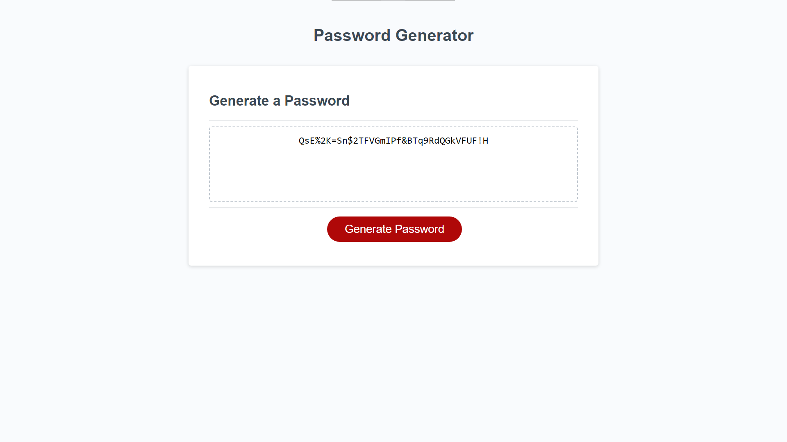

# Random Password Generator

## A random password gen. utilizing javascript functions, loops, prompts, arrays, returns, and if/else statements.

## Usage
In the browser open the provided link. When clicking the generate password button the page will site you with prompts. When prompts are filled the site will respond properly and generate or not generate your password depending what you clicked and wrote!

## Website Screenshot

## Deployment Link
https://ihateudvrk.github.io/Random-Password-Generator/

## Credits
@ EDX Bootcamp / University of Minnesota for source HTML and CSS code.
